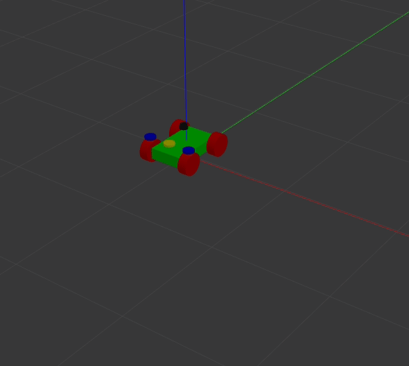

# mpc_ros_model 

## Overview

- This repository supports the `mpc_ros` repository for controlling various model like differential drive model, ackermann, holonomic model. This integrates the different models from other public packages, therefore you can clone the references separately.

## Requirements
``` sudo apt-get install ros-melodic-hector-gazebo-plugins ros-melodic-ackermann-steering-controller ros-melodic-rqt-robot-steering```

## Laucnch the Models 

### Differential Drive model

```roslaunch mpc_ros_description differential_model.launch```


### Ackermann model

```roslaunch mpc_ros_description ackermann_model.launch```



### Bicycle model
```roslaunch mpc_ros_description bicycle_model.launch```


### Holonomic model
```roslaunch mpc_ros_description holonomic_model.launch```


### Can select the model according to argument

```roslaunch mpc_ros_description models.launch```


## References

- [serving_bot](https://github.com/CzJaewan/servingbot)
- [differential_drive](http://wiki.ros.org/differential_drive)
- [steer_drive_controller](http://wiki.ros.org/steer_drive_controller)
- [steer_drive_ros](http://wiki.ros.org/steer_drive_ros)
- [hector_gazebo_plugins](http://wiki.ros.org/hector_gazebo_plugins)

